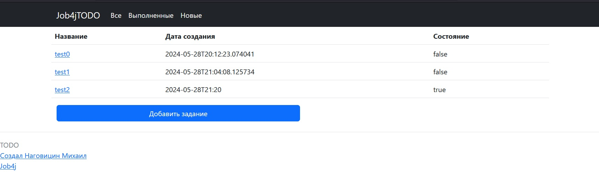
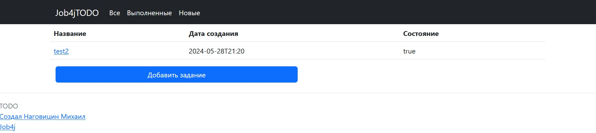
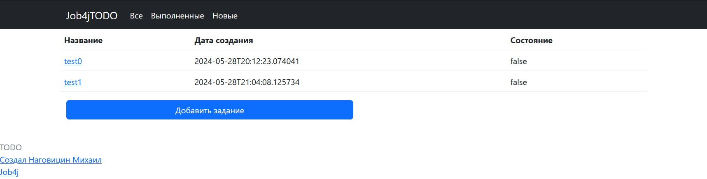

# job4j_todo

## О проекте

Проект "Список Дел". Основная функция хранить и отслеживать статус заявок. Проект содержит 3 вкладки и разные функции для взаимодействия с заявками.

### Вкладки

В проекте 3 вкладки: Все, Выполненные, Новые.

* Все - Вкладка отображает все заявки в проекте. 
* Выполненные - Вкладка отображает только выполненные заявки(Состояние = true). 
* Новые - Вкладка отображает только новые заявки(Новыми заявками в проекте считается Состояние = false) 

### Функции

Заявки можно: 

* создать
* просмотреть
* редактировать
* удалить

## Стек технологий

Java 17

Spring Boot 2.7.3

PostgreSQL 16

Hibernate 5

Lombok 1.18.22

Thymeleaf 2.7.3

Bootstrap 2.7.3

Liquibase 4.15.0


## Требования к окружению

Java 17

Maven 2.7.7

PostgreSQL 16


## Запуск проекта

Перед запуском проекта потребуется создать базу в PostgresSQL

```CREATE DATABASE job4j_todo```

Для запуска проекта нужно запустить класс Main.class

Выполните ряд команд

```javac <Путь до job4j_todo>/src/main/java/ru/job4j/todo/Main.java```

```java  <Путь до job4j_todo>/src/main/java/ru/job4j/todo/Main```

В браузере перейдите по ссылке 

```http://localhost:8080/tasks```

## Мой контакт 

Наговицин Михаил

Телеграм: @WolfyWood